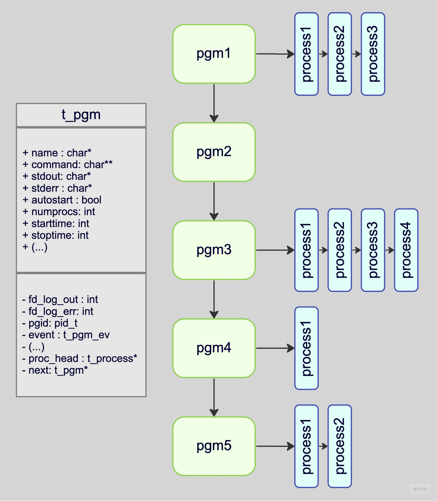
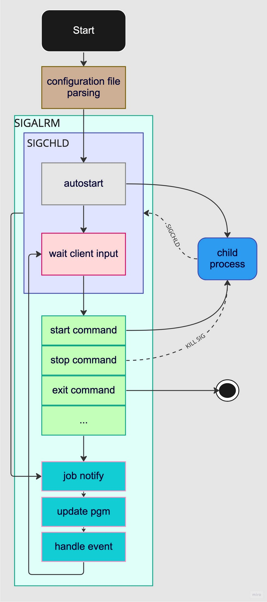
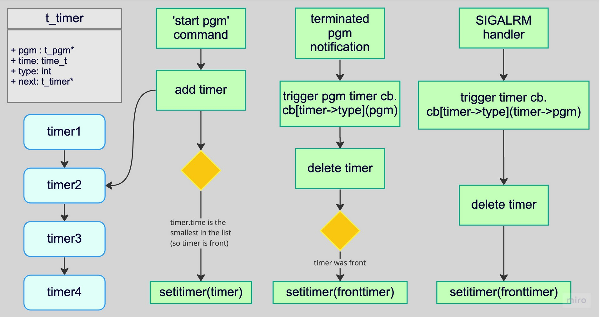

# taskmaster

**taskmaster** is a job supervisor, a little bit like supervisor, written in C.

- configuration file in yaml format.
- provide a lightweight CLI with history and auto-completion
- see the status of programs & processus
- stop, start, or restart a program
- reload configuration file (reload command or SIGHUP)
- activity logging
- others features detailed in configuration file.

This program is single-threaded & uses signals to perform async tasks. More information in the 'under the hood' section below.

The yaml parsing is made with the help of the [libyaml](https://github.com/yaml/libyaml).

I coded my own lighweight line editor to avoid the use of heavy _readline_ and just learn. This [line editor](https://github.com/antirez/linenoise) was my inspiration.

## build & usage

**clang** is needed to build taskmaster

```bash
$ git clone https://github.com/Jibus22/taskmaster.git && cd taskmaster
$ make prod
```

Here is a simple example of how to use taskmaster

```
$ ./taskmaster -f inexistentconfigfile.yaml
./taskmaster: inexistentconfigfile.yaml: No such file or directory
$ ./taskmaster
Usage: ./taskmaster [-f filename]
$ ./taskmaster -f configfile.yaml
taskmaster$ help
start <name>		Start processes
stop <name>		Stop processes
restart <name>		Restart all processes
reload		Reload the configuration file
status <name>		Get status for <name> processes
status		Get status for all programs
exit		Exit the taskmaster shell and server.
taskmaster$ status
- [17940] daemon_EPSILON: <1/1> started
- [0] daemon_DELTA: <0/1> started
- [17941] daemon_BETA: <5/5> started
- [17946] daemon_ALPHA: <2/2> started
taskmaster$ status daemon_ALPHA daemon_EPSILON
- [17946] daemon_ALPHA: <2/2> started
pid <17947> - running - restarted <0/3> times
pid <17946> - running - restarted <0/3> times
- [17940] daemon_EPSILON: <1/1> started
pid <17940> - running - restarted <0/2> times
taskmaster$ status uhsf ksf
./taskmaster: command error: bad argument
taskmaster$ tiud
./taskmaster: command error: command not found
taskmaster$ stop daemon_ALPHA
taskmaster$ status
- [17940] daemon_EPSILON: <1/1> started
- [0] daemon_DELTA: <0/1> started
- [17941] daemon_BETA: <5/5> started
- [0] daemon_ALPHA: <0/2> started
taskmaster$ start daemon_ALPHA
taskmaster$ status daemon_ALPHA
- [17955] daemon_ALPHA: <2/2> started
pid <17956> - starting - restarted <0/3> times
pid <17955> - starting - restarted <0/3> times
taskmaster$ reload
taskmaster$ status
- [17960] daemon_EPSILON: <7/7> started
- [17941] daemon_BETA: <5/5> started
taskmaster$ restart daemon_BETA
taskmaster$ status daemon_BETA
- [18039] daemon_BETA: <5/5> started
pid <18043> - running - restarted <0/2> times
pid <18042> - running - restarted <0/2> times
pid <18041> - running - restarted <0/2> times
pid <18040> - running - restarted <0/2> times
pid <18039> - running - restarted <0/2> times
taskmaster$
```

## Logging

**taskmaster** logs into _./taskmaster.log_. There is no way to modify it elsewhere than in the source define in _src/main.c_ for now. It should be an option in the config file.
Here is an example of a log:

```
2023-01-23, 18:32:30 taskmaster [INFO]: started
2023-01-23, 18:32:30 taskmaster [INFO]: (17905) daemon_EPSILON <17905> started
2023-01-23, 18:32:30 taskmaster [INFO]: (17906) daemon_DELTA <17906> started
2023-01-23, 18:32:30 taskmaster [INFO]: (17907) daemon_BETA <17907> started
2023-01-23, 18:32:30 taskmaster [INFO]: (17907) daemon_BETA <17908> started
2023-01-23, 18:32:30 taskmaster [INFO]: (17907) daemon_BETA <17909> started
2023-01-23, 18:32:30 taskmaster [INFO]: (17910) daemon_ALPHA <17910> started
2023-01-23, 18:32:30 taskmaster [INFO]: (17910) daemon_ALPHA <17911> started
2023-01-23, 18:32:31 taskmaster [INFO]: (17907) daemon_BETA successfully started. <1/1> seconds elapsed. <3/3> procs
2023-01-23, 18:32:32 taskmaster [INFO]: (17906) daemon_DELTA successfully started. <2/2> seconds elapsed. <1/1> procs
2023-01-23, 18:32:32 taskmaster [INFO]: (17910) daemon_ALPHA successfully started. <2/2> seconds elapsed. <2/2> procs
2023-01-23, 18:32:38 taskmaster [INFO]: (17905) daemon_EPSILON successfully started. <8/8> seconds elapsed. <1/1> procs
2023-01-23, 18:33:16 taskmaster [INFO]: (17905) daemon_EPSILON <17905> terminated with signal 10
2023-01-23, 18:33:16 taskmaster [INFO]: (0) daemon_EPSILON correctly terminated after <0/2> seconds elapsed. <0/1> procs left
2023-01-23, 18:33:16 taskmaster [INFO]: (17906) daemon_DELTA <17906> terminated with signal 10
2023-01-23, 18:33:16 taskmaster [INFO]: (0) daemon_DELTA correctly terminated after <0/4> seconds elapsed. <0/1> procs left
2023-01-23, 18:33:16 taskmaster [INFO]: (17907) daemon_BETA <17909> terminated with signal 10
2023-01-23, 18:33:16 taskmaster [INFO]: (17907) daemon_BETA <17908> terminated with signal 10
2023-01-23, 18:33:16 taskmaster [INFO]: (17907) daemon_BETA <17907> terminated with signal 10
2023-01-23, 18:33:16 taskmaster [INFO]: (0) daemon_BETA correctly terminated after <0/3> seconds elapsed. <0/3> procs left
2023-01-23, 18:33:21 taskmaster [INFO]: (17910) daemon_ALPHA didn't terminated correctly after <5/5> seconds elapsed. <2/2> procs left
2023-01-23, 18:33:21 taskmaster [INFO]: (17910) daemon_ALPHA <17911> terminated with signal 9
2023-01-23, 18:33:21 taskmaster [INFO]: (17910) daemon_ALPHA <17910> terminated with signal 9
2023-01-23, 18:33:21 taskmaster [INFO]: exited
2023-01-23, 18:33:26 taskmaster [INFO]: started
2023-01-23, 18:33:26 taskmaster [INFO]: (17940) daemon_EPSILON <17940> started
2023-01-23, 18:33:26 taskmaster [INFO]: (17941) daemon_BETA <17941> started
2023-01-23, 18:33:26 taskmaster [INFO]: (17941) daemon_BETA <17942> started
2023-01-23, 18:33:26 taskmaster [INFO]: (17941) daemon_BETA <17943> started
2023-01-23, 18:33:26 taskmaster [INFO]: (17941) daemon_BETA <17944> started
2023-01-23, 18:33:26 taskmaster [INFO]: (17941) daemon_BETA <17945> started
2023-01-23, 18:33:26 taskmaster [INFO]: (17946) daemon_ALPHA <17946> started
2023-01-23, 18:33:26 taskmaster [INFO]: (17946) daemon_ALPHA <17947> started
2023-01-23, 18:33:27 taskmaster [INFO]: (17941) daemon_BETA successfully started. <1/1> seconds elapsed. <5/5> procs
2023-01-23, 18:33:28 taskmaster [INFO]: (17946) daemon_ALPHA successfully started. <2/2> seconds elapsed. <2/2> procs
2023-01-23, 18:33:34 taskmaster [INFO]: (17940) daemon_EPSILON successfully started. <8/8> seconds elapsed. <1/1> procs
2023-01-23, 18:33:42 taskmaster [INFO]: (17940) daemon_EPSILON successfully started. <8/8> seconds elapsed. <1/1> procs
2023-01-23, 18:35:25 taskmaster [INFO]: (17946) daemon_ALPHA didn't terminated correctly after <5/5> seconds elapsed. <2/2> procs left
2023-01-23, 18:35:25 taskmaster [INFO]: (17946) daemon_ALPHA <17947> terminated with signal 9
2023-01-23, 18:35:25 taskmaster [INFO]: (17946) daemon_ALPHA <17946> terminated with signal 9
2023-01-23, 18:36:22 taskmaster [INFO]: (17955) daemon_ALPHA <17955> started
2023-01-23, 18:36:22 taskmaster [INFO]: (17955) daemon_ALPHA <17956> started
2023-01-23, 18:36:24 taskmaster [INFO]: (17955) daemon_ALPHA successfully started. <2/2> seconds elapsed. <2/2> procs
2023-01-23, 18:38:57 taskmaster [DEBUG]: pgm daemon_DELTA - del
2023-01-23, 18:38:57 taskmaster [DEBUG]: pgm daemon_ALPHA - del
2023-01-23, 18:38:57 taskmaster [DEBUG]: daemon_EPSILON hard reload
2023-01-23, 18:38:59 taskmaster [INFO]: (17940) daemon_EPSILON didn't terminated correctly after <2/2> seconds elapsed. <1/1> procs left
2023-01-23, 18:38:59 taskmaster [INFO]: (17940) daemon_EPSILON <17940> terminated with signal 9
2023-01-23, 18:38:59 taskmaster [INFO]: (17960) daemon_EPSILON <17960> started
2023-01-23, 18:38:59 taskmaster [INFO]: (17960) daemon_EPSILON <17961> started
2023-01-23, 18:38:59 taskmaster [INFO]: (17960) daemon_EPSILON <17962> started
2023-01-23, 18:38:59 taskmaster [INFO]: (17960) daemon_EPSILON <17963> started
2023-01-23, 18:38:59 taskmaster [INFO]: (17960) daemon_EPSILON <17964> started
2023-01-23, 18:38:59 taskmaster [INFO]: (17960) daemon_EPSILON <17965> started
2023-01-23, 18:38:59 taskmaster [INFO]: (17960) daemon_EPSILON <17966> started
2023-01-23, 18:39:04 taskmaster [INFO]: (17955) daemon_ALPHA didn't terminated correctly after <5/5> seconds elapsed. <2/2> procs left
2023-01-23, 18:39:04 taskmaster [INFO]: (17955) daemon_ALPHA <17956> terminated with signal 9
2023-01-23, 18:39:04 taskmaster [INFO]: (17955) daemon_ALPHA <17955> terminated with signal 9
2023-01-23, 18:39:07 taskmaster [INFO]: (17960) daemon_EPSILON successfully started. <8/8> seconds elapsed. <7/7> procs
2023-01-23, 18:39:33 taskmaster [INFO]: (17941) daemon_BETA <17945> terminated with signal 10
2023-01-23, 18:39:33 taskmaster [INFO]: (17941) daemon_BETA <17944> terminated with signal 10
2023-01-23, 18:39:33 taskmaster [INFO]: (17941) daemon_BETA <17943> terminated with signal 10
2023-01-23, 18:39:33 taskmaster [INFO]: (17941) daemon_BETA <17942> terminated with signal 10
2023-01-23, 18:39:33 taskmaster [INFO]: (17941) daemon_BETA <17941> terminated with signal 10
2023-01-23, 18:39:33 taskmaster [INFO]: (0) daemon_BETA correctly terminated after <0/3> seconds elapsed. <0/5> procs left
2023-01-23, 18:39:33 taskmaster [INFO]: (18039) daemon_BETA <18039> started
2023-01-23, 18:39:33 taskmaster [INFO]: (18039) daemon_BETA <18040> started
2023-01-23, 18:39:33 taskmaster [INFO]: (18039) daemon_BETA <18041> started
2023-01-23, 18:39:33 taskmaster [INFO]: (18039) daemon_BETA <18042> started
2023-01-23, 18:39:33 taskmaster [INFO]: (18039) daemon_BETA <18043> started
2023-01-23, 18:39:34 taskmaster [INFO]: (18039) daemon_BETA successfully started. <1/1> seconds elapsed. <5/5> procs
```

## Configuration file

Here is an example of a configuration file with comments:

```yaml
programs:
  daemon_ONE: # Name you give to the program. This is added in the auto-completion list of the CLI
    cmd: "/home/user/daemon1 arg1 arg2" # The command to use to launch the program
    numprocs: 2 # The number of processes to start and keep running
    umask: 777 # umask of the program (default: inherited from taskmaster)
    workingdir: /tmp # Working directory of the program (default: current)
    autostart: true # Whether to start this program at launch or not
    autorestart: unexpected # Whether the program should be restarted always, never, or on unexpected exits only
    exitcodes: # Which return codes represent an "expected" exit status (default: 0)
      - 0
      - 2
    startretries: 3 # How many times a restart should be attempted before aborting
    starttime: 2 # How long the program should be running after it’s started for it to be considered "successfully started" in seconds
    stopsignal: SIGTERM # Which signal should be used to stop (i.e. exit gracefully) the program
    stoptime: 5 # How long to wait after a graceful stop before killing the program, in seconds
    stdout: /tmp/alpha.stdout # Options to redirect the program’s stdout/stderr to files (default: /dev/null)
    stderr: /tmp/alpha.stderr
    env: # Environment variables given to the program
      STARTED_BY: taskmaster
      ANSWER: 42
  daemon_TWO:
    cmd: "/home/user/daemon2 arg1 arg2"
    numprocs: 5
    umask: 077
    workingdir: /home/user42
    autostart: true
    autorestart: true
    exitcodes: 0
    startretries: 2
    starttime: 1
    stopsignal: SIGUSR1
    stoptime: 3
    stdout: /tmp/beta.stdout
    stderr: /tmp/beta.stderr
```

### error handling & sanitation

Here is an example of error handling and sanitation of config file:

```
$ ./taskmaster -f test/config/config_5.yaml
Parse error: stopsignal key: wrong value
Line: 14 Column: 17
$ ./taskmaster -f test/config/config_5.yaml
Parse error: stoptime key: wrong value
Line: 15 Column: 15
$ ./taskmaster -f test/config/config_5.yaml
Sanitize error: daemon_ALPHA - cmd key: No such file or directory
Sanitize error: daemon_ALPHA - stdout key: No such file or directory
2 errors detected
$
```

## Under the hood

### data structure

_programs properties and processes ids & status are tracked through this data structure_


### activity overview

_here is a basic overview of taskmaster main logic_


### timer logic

_processes start & stop can be timed to act consequently and give a log back. Here is a basic logic overview diagram_


